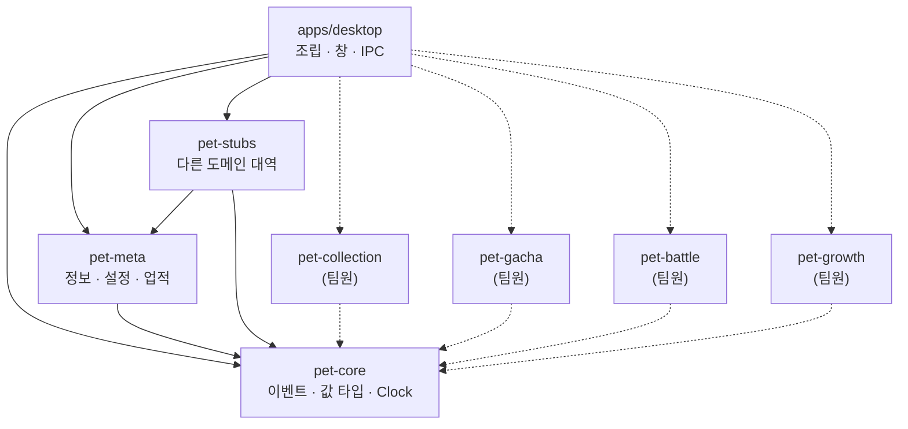

# 패키지 구조 제안

이 문서는 `meta` 도메인 프로토타입이 채택한 구조와 **왜 그렇게 했는지**를 설명한다.
다음 주 공통 베이스 논의의 출발점으로 쓰기 위한 것이고, 결정된 사항이 아니라 제안이다.

관련 문서

- 제품 기획서: [`.harness/specs/meta-info-settings-achievements-design.md`](.harness/specs/meta-info-settings-achievements-design.md)
- 프로토타입 범위: [`.harness/specs/features/2026-08-24-meta-domain-prototype.md`](.harness/specs/features/2026-08-24-meta-domain-prototype.md)

## 한 줄 요약

**도메인 패키지는 서로를 모른다.** 공용 커널(`@pet/core`)의 계약만 알고, 실제 구현은
앱이 조립할 때 꽂는다.

## Java로 읽는 TypeScript 용어

이 문서를 읽기 전에 알아 두면 편한 대응표다. **비유는 이해를 돕는 도구지 등호가 아니다.**
어긋나는 지점을 오른쪽 칸에 적었다.

| TypeScript / npm                     | Java에서 비슷한 것                          | 다른 점                                                                   |
| ------------------------------------ | ------------------------------------------- | ------------------------------------------------------------------------- |
| **패키지**(package)                  | Gradle 모듈 하나 (= JAR 하나)               | `package.json`이 경계다. `exports`에 적은 것만 밖에서 보인다              |
| **워크스페이스**(npm workspaces)     | Gradle 멀티프로젝트                         | 루트 `package.json`의 `workspaces`가 `settings.gradle`의 `include`에 해당 |
| `package.json`                       | `build.gradle` / `pom.xml`                  | 의존성·스크립트·진입점을 한 파일에                                        |
| `devDependencies`                    | `testImplementation` + 빌드 플러그인        | 배포물에 들어가지 않는다                                                  |
| `tsconfig.json`                      | 컴파일러 설정                               | `references`가 Gradle의 프로젝트 의존에 해당                              |
| **모듈**(파일 하나)                  | 패키지(package)                             | 파일 = 모듈이다. `export`한 것만 밖에서 보인다                            |
| `export`                             | `public`                                    | 안 붙이면 그 파일 안에서만 보인다                                         |
| **인터페이스**(interface)            | 인터페이스(interface)                       | 거의 같다. 단 런타임에 존재하지 않는다(타입만)                            |
| `class X implements Y`               | `class X implements Y`                      | 같다                                                                      |
| **판별 유니온**(discriminated union) | ⚠️ `sealed interface` + `record` (Java 17+) | **`enum`이 아니다.** 갈래마다 다른 데이터를 담는다                        |
| `switch` + `assertNever`             | `sealed` 타입에 대한 `switch` 패턴 매칭     | 안 다룬 갈래가 있으면 **타입 오류**                                       |
| `T \| undefined`                     | `Optional<T>`                               | 별도 래퍼가 아니라 타입에 붙는다                                          |
| `throw` / `try`                      | 예외                                        | 체크 예외가 없다. 무엇이 던져지는지 타입에 안 나온다                      |
| `Map` / `Set`                        | `HashMap` / `HashSet`                       | ⚠️ **객체 키를 참조로 비교한다.** 값이 같아도 다른 항목이다               |
| `#field`                             | `private` 필드                              | 런타임에도 진짜 접근 불가. `private` 키워드는 타입 검사만                 |
| `type PetId = string & {...}`        | `record PetId(String value)`                | 값 객체. 런타임 비용이 0이다                                              |
| `node --test`                        | JUnit                                       | Node에 내장. 별도 의존성이 필요 없다                                      |

### 특히 헷갈리는 셋

**판별 유니온은 `enum`이 아니다.** Java 17의 `sealed interface`에 `record`를 붙인 것에
해당한다. 갈래마다 다른 데이터를 담는다.

```java
// Java 17
sealed interface EventPayload permits PetAcquired, BattleFinished {}
record PetAcquired(PetId petId, Rarity rarity, AcquireSource source) implements EventPayload {}
record BattleFinished(String battleId, BattleResult result, int streak) implements EventPayload {}
```

```ts
// TypeScript — 위와 같은 것
export type EventPayload =
  | { eventType: 'pet.acquired'; petId: PetId; rarity: Rarity; source: AcquireSource }
  | { eventType: 'battle.finished'; battleId: string; result: BattleResult; streak: number };
```

둘 다 `switch`에서 안 다룬 갈래가 있으면 컴파일이 실패한다 — TypeScript에서는
`assertNever(payload, '...')`를 `default`에 두면 그 보장이 생긴다. 이 성질이 이 프로젝트에서
중요하게 쓰인다: 새 이벤트를 추가하면 그것을 처리해야 하는 모든 곳이 타입 오류로 드러나서
조용히 빠뜨릴 수가 없다.

**`Map`은 객체 키를 참조로 비교한다.** Java의 `HashMap`은 `equals`/`hashCode`를 쓰지만
JavaScript의 `Map`은 그렇지 않다. `{a: 1}`을 키로 넣고 똑같이 생긴 `{a: 1}`로 찾으면
못 찾는다. 그래서 이 코드베이스는 합성 키를 **문자열**로 만든다
(`usageKey(provider, date, rawModel)` → `'claude_code|2026-08-26|claude-opus-5'`).

**값 객체를 왜 만드나.** `PetId`와 `EventId`가 둘 다 `string`이면 서로 바꿔 넣어도
컴파일이 된다. 브랜드가 다르면 그 자리에서 오류가 난다. Java에서 `record UserId(String v)`를
만드는 것과 같은 이유이고, TypeScript에서는 런타임 비용 없이 된다.

## 패키지 지도

팀 결정: **feature 단위 상위 패키지**를 두고 그 안을 아키텍처별로 나눈다.

```
tamagochi-pet/
├── package.json                  # npm workspaces 정의
├── tsconfig.base.json            # 공용 컴파일러 설정
├── packages/
│   ├── pet-core/                 # 공용 커널 — 계약만, 로직 없음
│   ├── pet-meta/                 # ← 내가 맡은 feature
│   │   ├── src/domain/           #   규칙 (순수 로직)
│   │   │   ├── usage/            #     수집 · 통계
│   │   │   ├── achievement/      #     정의 · 사실 · 판정 · 진행률
│   │   │   ├── profile/          #     조련사 이름 · 칭호
│   │   │   ├── settings/         #     설정값과 패널 규약
│   │   │   ├── panel/            #     패널 배치 계산
│   │   │   └── state.ts          #     도메인 상태
│   │   ├── src/ports/            #   다른 도메인·인프라에 요구하는 인터페이스
│   │   ├── src/persistence/      #   저장 형식과 저장소 포트
│   │   ├── src/view/             #   화면 모델
│   │   └── test/                 #   기획서 인수 조건 계약 테스트
│   └── pet-stubs/                # 다른 도메인 대역 (어댑터 자리)
└── apps/
    └── desktop/
        ├── src/main/             # Electron 메인 — 조립 · IPC · 창 · 저장
        ├── src/preload/          # 렌더러에 노출하는 안전한 API 표면
        └── renderer/             # 화면 (HTML/CSS/JS + 펫 에셋)
```

### feature 안을 왜 아키텍처로 나누나

`@pet/meta`가 feature 경계이고, 그 **안**은 바뀌는 이유가 서로 다른 것끼리 나눈다.

| 폴더           | 바뀌는 이유                         |
| -------------- | ----------------------------------- |
| `domain/`      | 기획서의 규칙이 바뀔 때             |
| `ports/`       | 다른 도메인에 요구하는 것이 바뀔 때 |
| `persistence/` | 저장 방식이나 형식이 바뀔 때        |
| `view/`        | 화면에 무엇을 보여줄지가 바뀔 때    |

`domain/`은 나머지 셋을 모른다. 그래서 창도 파일도 없이 테스트할 수 있다.

의존 방향은 한쪽으로만 흐른다.



점선이 팀원들의 feature가 들어올 자리다. **feature끼리 잇는 화살표가 하나도 없다**는 것이
이 구조의 요점이다. (`@pet/stubs` → `@pet/meta`는 예외인데, 그것이 어댑터라서다 — 아래 참고.)

## 왜 폴더가 아니라 패키지로 나눴나

**Java로 바꿔 말하면 "패키지로 나눌 것인가, Gradle 모듈로 나눌 것인가"와 똑같은 질문이다.**

한 Gradle 모듈 안에서 `com.team.meta` 패키지는 `com.team.battle` 패키지를 마음대로
`import`할 수 있다. 막을 방법이 없다. 한 npm 패키지 안의 폴더도 정확히 그렇다.

Gradle 모듈로 쪼개고 `build.gradle`에 `implementation project(':battle')`을 적지 않으면
그 순간 `import`가 컴파일 오류가 된다. npm 패키지가 바로 그 역할이다. `package.json`의
`dependencies`에 없는 패키지는 해석되지 않는다.

"feature끼리 직접 의존하지 말자"가 약속이 아니라 빌드 실패가 된다.

확인은 파일 하나를 보면 된다.

```bash
cat packages/pet-meta/package.json
```

`dependencies`에 `@pet/core` 하나만 있어야 한다. 다른 feature가 있으면 그 순간 규칙이
깨진 것이다.

## `@pet/core`에는 규칙을 넣지 않는다

여기에는 네 가지만 있다.

| 모듈    | 내용                                                              |
| ------- | ----------------------------------------------------------------- |
| `ids`   | `PetId`, `Rarity`, `Provider`, `Coin`, `LocalDate`, `LocalMinute` |
| `event` | 이벤트 봉투와 기획서 9.2의 이벤트 8종                             |
| `ports` | 도메인 간 인터페이스 인터페이스                                   |
| `clock` | 시간 추상화                                                       |

**업무 로직은 한 줄도 없다.** 이건 취향이 아니라 방어선이다. 공용 커널에 로직이 들어가기
시작하면 다섯 도메인이 전부 이 패키지를 고치게 되고, 결국 "공용 커널"이 아니라
"공용 쓰레기통"이 된다. 그때부터는 패키지를 나눈 의미가 없어진다.

## 포트: 남의 도메인을 의존하지 않고 쓰는 법

`meta`는 업적 보상으로 코인을 지급해야 한다. 그런데 코인 원장은 `overlay-growth`가
소유한다. 선택지는 셋이다.

**(가) `@pet/meta`가 `@pet/currency`를 의존한다**

- 재화 쪽을 고치면 내 패키지가 컴파일 실패한다.
- 재화 패키지 없이는 내 테스트도 못 돌린다.
- 재화가 다시 `meta`를 필요로 하는 순간 순환 의존이 된다.

**(나) 공용 커널이 인터페이스를 선언하고 두 쪽이 그것만 안다**

의존 방향 문제는 풀리지만 새 문제가 생긴다. `CurrencyPort`는 "재화 도메인의 API"가
아니라 **"meta가 화면을 그리려면 무엇이 필요한가"**의 목록이다. 그것이 공용 커널에 있으면

- `battle`이 재화를 다른 모양으로 필요로 할 때 `meta`의 인터페이스에 억지로 맞추거나
  두 번째 인터페이스를 커널에 또 추가한다.
- 다섯 도메인이 각자 필요한 것을 넣으면 커널이 "공용 쓰레기통"이 된다.
  패키지를 나눈 이유가 사라진다.
- `meta`가 자기 화면 사정으로 인터페이스를 고칠 때마다 무관한 도메인이 전부 다시 컴파일된다.

**(다) 필요로 하는 쪽이 자기 포트를 소유한다** ← 채택

Java에서 이렇게 하는 것과 같다. `meta` 모듈이 자기가 필요한 인터페이스를 **자기 패키지에**
선언하고, 실제 구현체는 밖에서 주입받는다.

```java
// meta 모듈이 소유하는 인터페이스 — "내가 필요한 것"의 목록
package com.team.meta.ports;
public interface CurrencyPort {
    GrantOutcome grantOnce(String rewardKey, long amount, String reason);
    List<LedgerEntry> recentLedger(int limit);
}
```

Spring을 쓴다면 `meta` 서비스가 `CurrencyPort`를 생성자로 주입받고, 실제 구현은
설정 클래스가 꽂아 주는 그림이다. 인터페이스를 공용 모듈이 아니라 **쓰는 쪽 모듈에**
두는 것이 핵심이다.

```rust
// pet-meta/src/ports.rs — meta가 "무엇이 필요한지" 적은 목록
pub trait CurrencyPort: Send + Sync {
    fn grant_once(&self, reward_key: &str, amount: Coin, reason: &str) -> PortResult<GrantOutcome>;
    fn grant_usage_tokens(&self, dedupe_key: &str, reward_tokens: u64, reason: &str)
        -> PortResult<GrantOutcome>;
    fn balance(&self) -> PortResult<Coin>;
    fn recent_ledger(&self, limit: usize) -> PortResult<Vec<LedgerEntry>>;
    fn totals(&self) -> PortResult<CurrencyTotals>;
}
```

`@pet/meta`의 함수는 `&dyn CurrencyPort`를 받는다. Java로 치면 파라미터 타입이
인터페이스인 것이고, 누가 구현했는지 모르고 알 필요도 없다.
실제 `@pet/currency` 패키지는 **이 인터페이스를 알지 못한다.** 둘을 잇는 어댑터는 앱이 쓴다.

```text
pet-meta ──requires──▶ CurrencyPort ◀──implements── 어댑터 ──uses──▶ pet-currency
```

이 방향이라 다섯 도메인이 **서로를 모르는 상태로 각자 개발되고 각자 테스트된다.**
통합은 앱에서 한 번만 일어난다.

포트를 도메인별로 잘게 나눈 것도 의도다 — `CurrencyPort`, `CollectionPort`, `GachaPort`,
`BattlePort`, `GrowthPort`. 하나의 큰 `WorldPort`로 묶으면 전투 승수 하나 읽으려고
도감 API까지 구현해야 한다.

### 그래서 공용 커널에 남은 것

| 남은 것                                                       | 남긴 이유                                                        |
| ------------------------------------------------------------- | ---------------------------------------------------------------- |
| `ids` — `PetId`, `Rarity`, `Coin`, `LocalDate`, `LocalMinute` | 다섯 도메인이 공유하는 어휘                                      |
| `event` — 봉투와 이벤트 8종                                   | 기획서 9.2가 정한 도메인 간 계약                                 |
| `EventBus`                                                    | 실어 나르는 것이 이미 공용 계약이라 한 쌍                        |
| `PortError`                                                   | 포트를 누가 정의하든 실패는 같은 모양으로 다뤄야 화면이 일관된다 |
| `Clock`                                                       | 시간 의존 규칙을 테스트 가능하게 만드는 공통 장치                |

특정 도메인이 필요로 하는 포트는 여기 없다. 확인은 명령 한 줄로 된다.

```bash
grep -rn "^pub trait" crates/pet-core/src/
```

`Clock`과 `EventBus` 둘만 나와야 한다. 셋째가 나오면 그것이 정말 다섯 도메인 공통인지
따져 봐야 한다.

## 왜 `@pet/stubs`가 별도 패키지인가

다른 도메인이 아직 없으니 대역이 필요하다. 놓을 자리는 세 곳이 후보였다.

| 위치            | 문제                                                  |
| --------------- | ----------------------------------------------------- |
| `@pet/meta` 안  | 내 feature가 남의 도메인 구현을 들고 있는 모양이 된다 |
| 앱 안           | 테스트에서 쓸 수 없어 대역을 두 벌 만들게 된다        |
| **별도 패키지** | 앱과 테스트가 같은 대역을 쓴다                        |

`@pet/stubs`는 `@pet/meta`의 포트를 구현하므로 `@pet/meta`를 의존한다. 즉 **어댑터 자리**다.
실제 도메인이 완성되면 이 어댑터는 앱으로 옮겨간다. 진짜 `@pet/currency`는 meta의
인터페이스를 모른 채 자기 API를 갖고, 앱이 그 사이를 잇는다. `@pet/meta`는 어느 경우에도
손대지 않는다.

`@pet/meta`의 `dependencies`에는 여전히 `@pet/core` 하나뿐이다 — 테스트가 `@pet/stubs`를
쓰지만 그건 테스트 코드의 import이고 패키지 의존이 아니다.

## 시간은 항상 인터페이스를 통해 읽는다

```rust
pub trait Clock: Send + Sync {
    fn now(&self) -> DateTime<FixedOffset>;
}
```

도메인 로직이 `Local::now()`를 직접 부르면 그 로직은 테스트할 수 없다. Java에서
`LocalDateTime.now()`를 코드 안에서 부르는 대신 `java.time.Clock`을 주입받아
테스트에서 `Clock.fixed(...)`를 넣는 것과 **완전히 같은 이야기**다.

기획서 8.6의 "같은 로컬 분에 세 소스가 증가해도 활동 시간은 1분" 같은 규칙은 시각을
**고정**할 수 있어야 검증된다. 앱은 `SystemClock`을, 테스트는 `FixedClock`을 쓴다.

## 로컬 저장

팀 결정에 따라 서버도 DB 서버도 두지 않고 **사용자 기기의 파일 하나**에 저장한다.
메모리에서 돌리고, 상태가 바뀌면 스냅샷을 남기는 방식이다.

```rust
// pet-meta가 소유하는 포트 — Java의 Repository 인터페이스 하나
pub trait MetaStore: Send + Sync {
    fn load(&self) -> PortResult<Option<MetaSnapshot>>;   // 없으면 Ok(None) = 새 설치
    fn save(&self, snapshot: &MetaSnapshot) -> PortResult<()>;
}
```

도메인은 "저장한다 / 읽어 온다"만 안다. 파일인지 SQLite인지는 앱이 정하고, 테스트는
인메모리 구현을 꽂는다.

### 저장 형식과 런타임 표현을 나눈다

Java의 엔티티와 DTO를 나누는 것과 같은 이야기다.

|                | 무엇에 맞춰져 있나                                                                                         |
| -------------- | ---------------------------------------------------------------------------------------------------------- |
| `MetaState`    | **조회.** `usage_daily`가 `BTreeMap<(Provider, LocalDate, String), _>`인 것은 조회가 O(log n)이기 때문이다 |
| `MetaSnapshot` | **저장.** 맵을 배열로 펴서 각 항목이 자기 키를 필드로 들고 있다                                            |

나눈 데는 실용적인 이유가 하나 더 있다. `MetaState`를 그대로 JSON으로 쓰면 **직렬화가
실패한다.**

```
JSON 실패: key must be a string
```

JSON 객체의 키는 문자열만 가능한데 저 맵의 키는 튜플이기 때문이다. 스냅샷이 그 문제를
없앤다. 덤으로 런타임 자료구조를 바꿔도 저장 파일이 깨지지 않고, 저장 형식을 바꿀 때는
`SCHEMA_VERSION`을 올려 한곳에서 변환한다.

### 쓰기는 원자적으로

파일을 직접 열어 덮어쓰면, 쓰는 도중 앱이 죽었을 때 **반쪽짜리 JSON이 남는다.** 다음
실행에서 파싱이 실패하고 사용자는 펫과 업적을 통째로 잃는다.

임시 파일에 완전히 쓴 뒤 `rename`으로 갈아 끼운다. 같은 파일 시스템 안의 이름 바꾸기는
원자적이라 중간 상태가 존재하지 않고, 실패해도 직전 정상 파일이 그대로 남는다.

깨진 파일을 만나면 조용히 지우지 않고 `.corrupt-<시각>`으로 옮겨 둔 뒤 새로 시작한다.
복구 여지를 남기고 버그 리포트에 첨부할 수 있게 하기 위해서다.

### 무엇을 저장하지 않는가

- **업적 카테고리 필터** — 기획서 4.2가 "현재 실행 중에만 기억하고 앱을 다시 시작하면
  `전체`로 돌아간다"고 정하므로 애초에 `MetaState` 밖에 있다.
- **오버레이 펫** — `collection` 도메인이 소유한다. `meta`가 같이 저장하면 두 곳이 어긋난다.
  (`overlay_pet_is_not_persisted_by_meta` 테스트가 이것을 고정한다)

저장 단위를 도메인별로 나눌지 공용 파일 하나로 할지는 아직 팀 안건이다 —
[`COMMON-BASE-DECISIONS.md`](COMMON-BASE-DECISIONS.md)를 보라.

## 앱 계층은 얇게

`apps/desktop/src-tauri`에는 세 가지만 있다.

- `app_state.rs` — 무엇을 무엇에 꽂을지 (배선). Spring의 `@Configuration` 클래스 자리다
- `commands.rs` — IPC 진입점. `@pet/meta` 함수를 부르고 결과를 그대로 돌려준다.
  Spring MVC의 `@RestController`에 해당한다
- `windows.rs` — 좌표 계산 결과를 실제 창에 적용

규칙이 이 계층에 들어오면 창을 띄우지 않고는 테스트할 수 없어진다. 예를 들어 패널 배치
규칙(기획서 4.2)은 창 API가 아니라 `pet_meta::panel::place_panel`이라는 **순수 함수**로
있고, 멀티모니터 경계까지 단위 테스트가 붙어 있다. `windows.rs`는 그 함수가 돌려준
좌표를 창에 넣기만 한다.

프론트엔드에도 규칙이 없다. 히든 업적 마스킹조차 TypeScript에서 끝난다 — UI에서 가리면
잠긴 히든 업적의 이름과 조건이 IPC 응답에 그대로 실려 나가기 때문이다.

## 테스트가 어디에 있나

```bash
bash .harness/scripts/verify-electron.sh
```

| 위치 | 대상 |
| ---- | ---- |

| `packages/pet-meta/test/collect.contract.test.ts` | 기획서 COLLECT-002 ~ 009 |
| `packages/pet-meta/test/achievement.contract.test.ts` | 기획서 ACH-001 ~ 009 |
| `packages/pet-meta/test/info-settings.contract.test.ts` | 기획서 INFO-_, SET-_, META-002 |
| `packages/pet-meta/test/persistence.contract.test.ts` | 재실행 후 유지 (기획서 8.2 · 4.3 · 5.1 · 9.4 · SET-007) |

통합 테스트 파일은 **기획서의 인수 조건 ID를 테스트 이름에 넣는다.** 기획서가 바뀌면
어느 테스트를 고쳐야 하는지 바로 보인다.

## 실행과 확인

```bash
npm install     # 처음 한 번
npm start       # tsc 빌드 후 Electron 실행
```

펫이 화면 오른쪽 아래에 뜬다. **좌클릭 드래그**로 옮기고 **우클릭**으로 정보·설정·업적을
연다. 트레이 메뉴에도 같은 항목이 있다.

패널의 `⚗` 버튼은 시연용 화면이다. 다른 도메인이 아직 없어서 `pet.acquired`,
`battle.finished` 같은 이벤트를 발행해 줄 주체가 없으므로, 거기서 손으로 넣어 업적 판정이
도는 것을 볼 수 있다. 수집 실패와 보상 지급 실패도 주입해 기획서 11.1의 오류 동작을
확인할 수 있다.

개발용 환경변수 두 개가 있다.

| 변수                         | 효과                                                        |
| ---------------------------- | ----------------------------------------------------------- |
| `META_PROTO_OPEN_PANEL=info` | 펫 우클릭 없이 패널을 띄운 채로 시작한다                    |
| `META_PROTO_SELFTEST=1`      | 모든 화면과 서브탭을 순회하며 렌더 결과를 stdout에 보고한다 |

자체 점검은 클릭과 같은 코드 경로를 지나므로, 화면을 눈으로 볼 수 없는 환경에서도
"세 패널이 실제로 그려지는가"를 확인할 수 있다. 요약 화면이 스크롤 없이 들어가는지
(기획서 INFO-001)도 실제 픽셀로 측정해 보고한다.

```
[SELFTEST] info/summary   노드  45개  내용 391px / 보이는 영역 391px  스크롤 없음
[SELFTEST] achievements   노드 330개  내용 1879px / 보이는 영역 420px  스크롤 있음
```

## 펫 에셋 연동

스프라이트는 팀원이 만든 도트 에셋을 그대로 쓴다. 원본 가이드(`pets/README.md`)의 경로
규칙을 지켜 `apps/desktop/ui/assets/pets/{grade}/{slug}/stage{N}/`에 그대로 두었다.
현재 들어 있는 것은 EPIC `star_wizard`(별빛마법사) 3단계 풀세트다.

**어느 펫을 그릴지는 meta가 정하지 않는다.** `CollectionPort::overlay_pet()`이 돌려주는
`PetSummary`에서 세 값이 나오고, 파일 경로는 그리는 쪽(펫 창)이 조립한다.

| 경로 조각       | 출처                                                    |
| --------------- | ------------------------------------------------------- |
| `{grade}`       | `PetSummary.rarity` → 소문자 (`EPIC` → `epic`)          |
| `{slug}`        | `PetSummary.sprite`                                     |
| `stage{N}`      | `PetSummary.level` → 가이드 §3의 구간 (Lv.20~29 → 3)    |
| `pet_{petId}_…` | 종 메타 `pet.json`에서 조회 (슬러그만으로는 알 수 없음) |

가이드가 실패 원인 1~4순위로 꼽은 것들은 코드에 못박아 두었다.

- 프레임 크기·개수는 **옆 JSON에서 읽는다.** 32로 하드코딩하지 않는다.
- 프레임 i의 소스 사각형은 `(i × frameWidth, 0, frameWidth, frameHeight)`.
- 확대는 **정수 배율 nearest-neighbor**만. `imageSmoothingEnabled = false`.
- `click`과 `click2`를 **랜덤으로 번갈아** 재생하고, 1회 재생이 끝나면 idle로 돌아간다.

시연용 펫을 **Lv.21(stage 3)** 로 잡은 것은 의도적이다. EPIC stage 3만 캔버스가 48px이라
(다른 전부 32px), 어딘가에 32를 하드코딩했다면 그 자리에서 잘려 보인다.

실제 렌더 결과는 앱에서 직접 확인할 수 있다.

```bash
META_PROTO_SELFTEST=1 npm start
```

| 변수                         | 효과                                           |
| ---------------------------- | ---------------------------------------------- |
| `META_PROTO_OPEN_PANEL=info` | 펫 우클릭 없이 패널을 띄운 채로 시작           |
| `META_PROTO_SELFTEST=1`      | 모든 화면을 순회하며 렌더 결과를 터미널에 보고 |

펫 창이 스프라이트 메타(프레임 크기·개수·배율)와 실제로 칠해진 픽셀 수를 터미널에 보고한다.
스프라이트 파일을 읽는 데 성공한 것과 화면에 제대로 그려진 것은 다른 얘기라서, 배율이나
소스 사각형이 틀리면 여기서 드러난다.

## 팀원이 자기 도메인을 추가하는 절차

1. `packages/pet-<feature>/`를 만든다. 루트 `package.json`의 `workspaces`가
   `packages/*`이므로 자동으로 잡힌다.
   (= 새 Gradle 모듈을 만들고 `settings.gradle`에 `include` 하는 것)
2. `dependencies`에 `@pet/core`만 넣는다.
   (= `build.gradle`에 `implementation project(':core')` 한 줄만)
3. 그 안을 아키텍처별로 나눈다 — `domain/`, `ports/`, `view/`.
4. 다른 도메인의 값이 필요하면 `pet-core/src/ports.rs`에 인터페이스를 추가한다 —
   상대 패키지를 의존하지 않는다.
5. 자기 도메인이 발행할 이벤트를 `pet-core/src/event.rs`의 `EventPayload`에 추가한다.
   (열거형이라 이것을 `match`하는 모든 곳에서 컴파일 오류가 나므로, 처리하지 않고
   지나가는 이벤트가 생길 수 없다.)
6. 앱의 `app_state.rs`에서 `@pet/stubs`의 대역을 실제 구현으로 바꾼다.

## 다음 주에 정할 것

이 프로토타입이 **결정하지 않은** 것들이다. 선택지와 트레이드오프는
[`COMMON-BASE-DECISIONS.md`](COMMON-BASE-DECISIONS.md)에 정리했다.

| 항목                  | 프로토타입의 임시 선택       | 정할 것                                   |
| --------------------- | ---------------------------- | ----------------------------------------- |
| 공용 커널 이름·경계   | `@pet/core`, 계약만          | 이름과 "무엇까지 담을지" 기준             |
| 영속 저장소           | 없음 (인메모리)              | SQLite/파일 선택과 도메인별 스키마 소유권 |
| 이벤트 버스           | 인프로세스 `Vec`             | 영속 큐가 필요한지, 순서 보장 수준        |
| 프론트엔드 프레임워크 | 없음 (바닐라 JS)             | React/Svelte 도입 여부                    |
| 패키지 이름 규칙      | `@pet/<feature>`             | 스코프와 앱 패키지 이름                   |
| 오류 타입             | 도메인별 `Error` 하위 클래스 | 예외 계층을 어디까지 세분할지             |

## 프로토타입에서 실제로 잡은 버그

구조를 설명하는 문서지만, 이 구조가 무엇을 잡아냈는지도 함께 남긴다.

**1. 멱등 키를 나중에 되찾으면 안 된다.** 사용량 증가분의 멱등 키는
`<provider>:<이전 총합>-><현재 총합>` 문자열이다. 처음에는 지급 요청 시점에 저장된 키
집합에서 "이 소스의 마지막 키"를 찾아 썼는데, 문자열 정렬은 사전순이라
`90->100`이 `100->250`보다 뒤에 온다. 누적이 0 → 90 → 100 → 250으로 오르면 세 번째
증가분이 이전 키로 지급을 요청하고, 이미 지급된 키라 `AlreadyGranted`가 돌아와
**코인이 조용히 사라졌다.** 지금은 키를 `SourceOutcome`에 실어 나른다.

**2. 창을 만든 직후에는 좌표를 읽을 수 없다.** 창 이동 요청은 이벤트 루프가 처리하므로,
같은 턴에서 좌표를 읽으면 아직 옛 값이 나온다. 그 상태로 패널을 배치하면 펫이 아니라 화면
한가운데 붙는다. Rust·Tauri에서 처음 발견한 문제인데 Electron에서도 같아서, 개발용 패널
자동 열기를 `setTimeout`으로 미뤄 두었다.

**3. 데모 데이터가 기준점에 통째로 흡수됐다.** 기획서 8.2대로 첫 스캔은 기준점만 만드는데,
픽스처에 12주치를 미리 넣어 두면 그게 전부 기준점이 되어 화면이 텅 빈다. 빈 기준점을 먼저
잡고 그 뒤에 사용 기록을 심어야 한다.

1번은 통합 테스트로, 2번과 3번은 앱 자체 점검 로그로 잡혔다.

## 발견한 계약 문제 하나

기획서 5.1의 `오늘 획득 코인`은 "오늘 발생한 양수 원장 항목의 합"인데, 기획서 9.5가
재화 도메인에 요구하는 조회는 **최근 원장 20건**뿐이다. 하루에 20건이 넘는 획득이 있으면
합계가 실제보다 작아진다.

프로토타입은 넉넉한 개수를 요청해 우회했지만, 옳은 해결은 재화 소유자와 **날짜 범위로
조회하는 인터페이스**를 합의하는 것이다. 다음 주 안건으로 올릴 항목이다.
