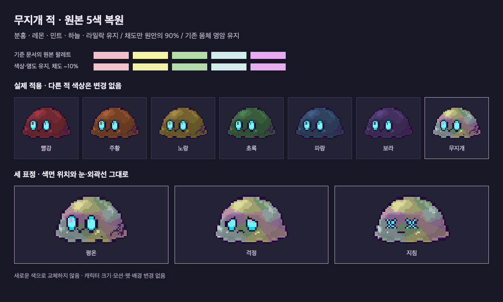

# 무지개 적 파스텔 색 배합

이 문서의 원본 5색이 기준이다. 아래 교정 규칙을 현재 적용하며, [이전 톤 조정](2026-09-30-rainbow-muted-tone.md)의 대체 팔레트는 폐기했다.

## 현재 적용 · 원본 색상 유지, 채도만 소폭 감소

- 2026-09-30 사용자 정정: “여기에서 채도를 낮추라는 거지 색을 변경하라는 뜻이 아님.”
- Track: `standard`. Seed는 이 문서의 승인된 최초 배합과 위 정정 요청이다. 다른 6색·배경·펫·형태·표정·크기·모션은 변경하지 않는다.
- Explorer: 이전 변경은 원본 색상(H)까지 약 8~27° 바꾸고 팔레트 밝기를 낮췄다. 레몬이 황토색, 민트가 청록, 라일락이 회보라처럼 된 원인이다.
- Planner/Implementer: 원본 RGB를 복원하고 각 색을 HSL 중간 회색 `(최댓값 + 최솟값) / 2` 쪽으로 10%만 이동한다. **팔레트의 색상·명도는 유지하고 채도만 원안의 90%**로 맞춘다. 정수 반올림에 따른 색상 오차는 1° 미만이다.
- 다른 적과 공유하는 그림자 식 `min(0.28 + 원본 밝기 × 0.68, 0.92)`과 14개 얼룩 위치·반경은 그대로다. 색을 억지로 어둡게 재선정하거나 노랑 적의 밝기 이하로 제한하지 않는다.

| 색     | 기준 문서 원본 | 채도만 −10%인 기본색 |
| ------ | -------------- | -------------------- |
| 분홍   | `#F3BFCB`      | `#F0C2CC`            |
| 레몬   | `#F4F6A3`      | `#F0F2A7`            |
| 민트   | `#B2DFA7`      | `#B4DCAA`            |
| 하늘   | `#D2EEEC`      | `#D3EDEB`            |
| 라일락 | `#EAAAF1`      | `#E7AEED`            |

실제 게임 PNG에는 위 기본색에 기존 공통 명암을 적용한다. 기존 Rust 생성기의 편집 가능한 색 정의만 수정했으며 새로운 그림을 생성하거나 원본 픽셀을 다시 그리지 않았다.

### 교정 검증

- RED `ee87e7b`: 원본 팔레트·색상 보존 테스트 2개 실패. GREEN `b60a47b`: 에셋 계약 6/6 통과.
- Mechanical: Rust 전체 46개, fmt·Clippy 통과. 공통 Electron 포맷·타입·전체 409개 테스트 통과.
- Semantic: PNG 48개 SHA-256 비교에서 무지개 3개만 변경, 나머지 45개 동일. 실제 표정 3개에서 크기·알파·눈·외곽선·공통 음영을 검증했다. 격리 Chrome에서 64px·96px 렌더링을 확인했으며 사용자 앱·DB는 열지 않았다.
- Evolve: 색상 보존·HSL 명도·채도 비율을 회귀 테스트로 고정했다. 명암 강도와 팔레트 재선정을 혼동하지 않는다.
- Independent Review: 별도 검토자가 코드·최종 비교 이미지·범위를 확인하고 에셋 계약 6개를 재실행했다. 수정 필요 결함 없음. Rust 정량 커버리지는 `cargo-llvm-cov` 미설치로 측정하지 않았으며 추가 설치는 하지 않았다.
- 범위: 전투 패키지 내부만 변경. 기존 시안·프롬프트 기록은 아래에 보존한다. 원격 push는 하지 않았다.

[현재 비교 화면](art/rainbow-reference-saturation.html)

## 최초 시안 기록

- 작업: lightweight. 사용자 제공 별똥별 이미지의 색 배합을 기존 무지개 슬라임 몸에 적용한다.
- 범위: 무지개 색상 함수와 3표정 PNG. 모양·눈 위치·표정·크기·투명 영역·모션·다른 6색·배경·펫은 변경하지 않는다.
- 배합: 연핑크 `#F3BFCB`, 레몬 `#F4F6A3`, 민트 `#B2DFA7`, 하늘 `#D2EEEC`, 라일락 `#EAAAF1`.
- 기존 회보라 바탕 86.47% + 작은 반점 구조를, 몸 전체를 채우는 넓고 불규칙한 2차원 색면으로 바꾼다. 원본 음영은 유지하고 가로 무지개 줄무늬는 만들지 않는다.
- 시안: 내장 imagegen으로 색 배합만 검토했다. 게임 에셋은 원본 픽셀을 보존하기 위해 기존 Rust 생성기로 재현한다. 참고 이미지의 별·문자·워터마크는 사용하지 않는다.

## 파일

- 색 배합 시안: `art/rainbow-pastel-study.png`
- 실제 적용 3표정: `art/rainbow-pastel-preview.html` / `art/rainbow-pastel-preview.png`
- 게임 에셋: `assets/enemies/v2/rainbow-{steady,worried,exhausted}.png`

## 검증

- 팔레트·색면 비중 테스트 RED → GREEN. 에셋 계약 3개 및 전체 Rust 43개 통과.
- 전체 하네스 format/typecheck 및 Node 테스트 264개 통과. Rust fmt/Clippy 통과. 독립 코드·이미지 리뷰에서 조치 필요 항목 없음.
- 생성 전후 30개 파일 해시 비교: 무지개 3개만 변경. 나머지 적 18개, 원본 3개, 펫 6개 동일.
- 이전 PNG와 새 PNG를 직접 디코딩해 비교: 세 표정의 전체 alpha와 눈·외곽선·투명 픽셀 동일. 크기 49×32 / 49×32 / 51×32 유지.
- 80px 실제 표시 및 160px 확대 화면을 격리 headless Chrome에서 확인. 사용자 Electron 앱·DB는 실행하지 않았다.
- 비범위: 새 캐릭터·전투 기능·공통 폴더 변경·원격 push. 하네스 개선 사항 없음.

## 색 배합 시안 프롬프트

내장 imagegen, edit 모드. 입력 1은 기존 `rainbow-steady.png`, 입력 2는 사용자의 색상 참고 이미지다. 다음 프롬프트로 시안을 생성했으며, 실제 게임용 파일은 별도 Rust 생성 결과다.

> Use case: precise-object-edit. Create a recolor design study for a pixel-art game slime. Image 1 is the edit target: the existing tiny low-resolution slime. Image 2 is ONLY a COLOR PALETTE reference, not an image to copy; do not reproduce its stars, shapes, text or watermark. Change ONLY the slime BODY COLOR using image 2's milk-pink #F3BFCB, light lemon #F4F6A3, mint #B2DFA7, ice-aqua #D2EEEC and pastel lilac #EAAAF1. Use large irregular interlocking color patches distributed in two dimensions across the body, like beautiful soft candy marbling, NOT horizontal/vertical rainbow stripes, not a dull gray body with tiny confetti dots, not washed-out white. No smooth blur or gradients: retain crisp chunky pixel clusters, upper-left light and modest lower-right shadow. Keep the exact existing squat wide slime silhouette, scalloped bottom, two cyan oval eyes with dark outlines positioned toward the LEFT of the body, and all original facial proportions/expression. Do not add a mouth, accessories, horn, sparkle, aura or extra characters. Display just one enlarged nearest-neighbor-looking sprite on genuinely transparent background; the enlarged illustration is a palette design study to port back into the original 32px-high sprite, so do not add extra pixel detail. No text or watermark.
