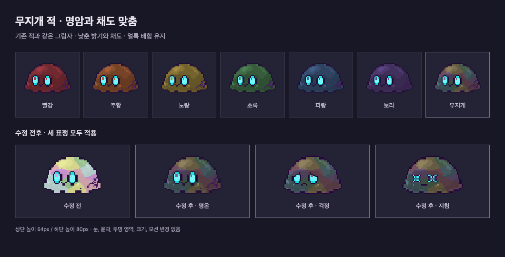

# 무지개 적 명암·채도 조정

이 문서는 이전 시도의 기록이다. 사용자의 “색상은 바꾸지 말고 채도만 낮추기” 정정에 따라 아래 대체 RGB 팔레트는 더 이상 사용하지 않는다. 현재 기준은 [원본 색상 유지·채도 교정](2026-09-29-rainbow-palette.md#현재-적용--원본-색상-유지-채도만-소폭-감소)을 따른다.

## 범위와 기준

- Track: `standard`. Seed는 기존 승인된 `battle-ui.md`의 어두운 도트 스타일과 사용자의 무지개 톤 조정 요청이다.
- 성공 기준: 빨강~보라 적과 같은 명암, 차분한 5색 얼룩, 세 표정에 동일 적용.
- 변경 제외: 펫, 다른 색 적, 배경, 눈·윤곽·알파·크기·모션, 공통 모듈.

## 구현

- Explorer: `rust/src/asset_pipeline.rs`에서 무지개만 밝기를 올리는 별도 계산식이 있었다. 생성된 PNG를 기존 전투 UI와 적 말풍선 얼굴이 함께 사용한다.
- Planner: 팔레트·명암·완성 에셋 검증을 먼저 추가하고 생성기와 무지개 PNG 3개만 수정한다.
- Implementer: 다른 색과 동일한 명암식 `min(0.28 + 원본 밝기 × 0.68, 0.92)`을 적용했다. 14개 얼룩의 위치·반경은 유지했다.

| 색   | 새 기본 RGB   |
| ---- | ------------- |
| 분홍 | 151, 104, 121 |
| 노랑 | 158, 142, 104 |
| 민트 | 105, 137, 113 |
| 하늘 | 102, 134, 144 |
| 보라 | 137, 111, 157 |

원본 픽셀을 다시 그리지 않고 기존 Rust 에셋 생성기를 사용한다. 적용 파일은 `assets/enemies/v2/rainbow-{steady,worried,exhausted}.png`다.

## 검증

- RED `3501ea8`: 계약 테스트 3개가 기존 팔레트·명암·완성 이미지 밝기에서 실패, 2개 통과.
- GREEN `257a09d`: 계약 테스트 5/5 통과. 완성 PNG도 다른 적과 실루엣·눈·외곽선이 같고, 노랑 적보다 밝게 뜨지 않는지 검사한다.
- Mechanical: Rust 전체 45/45, `cargo fmt --check`, `cargo clippy --all-targets -- -D warnings` 통과. 공통 `verify-electron.sh`의 포맷·타입 검사와 392/392 테스트 통과.
- Semantic: 에셋 54개의 전후 SHA-256 비교에서 무지개 3개만 변경됐다. 나머지 51개는 동일하다. 별도 임시 Chrome으로 7색 나란히 보기와 세 표정을 64·80px 높이로 렌더링했다. 사용자 앱·DB는 열지 않았다.
- Independent Review: 별도 검토자가 코드·비교 이미지를 확인하고 계약 테스트 5/5를 재실행했다. 수정 필요 사항 없음.
- 검증 한계: Rust 커버리지 측정 도구(`cargo-llvm-cov`, `llvm-tools`)가 없어 정량 커버리지는 측정하지 않았다. 설치나 의존성 변경은 하지 않았다.
- Evolve: 무지개만 별도 밝기 보정을 적용하지 않는 규칙을 `battle-ui.md`에 반영했다.

[비교 화면 HTML](art/rainbow-muted-preview.html)
