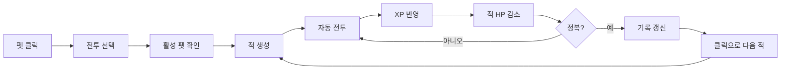

# 전투 시스템

## 흐름

## 전투 규칙

- 상태 흐름: `대기 → 자동 전투 → 적 정복 연출 → 다음 적 등장 → 자동 전투`
- 사용자가 중지하면 `일시 정지`가 된다.
- 성장 feature가 보낸 XP만 전투 진행도에 반영한다. 데모의 버튼은 표현 확인용이다.
- 적 HP가 0이 되면 처치 모션 후 클릭을 기다린다. 클릭하면 다음 적을 생성한다.
- 활성 펫별 스테이지와 구간 XP를 독립적으로 보관한다.
- 합성 이후 보너스가 필요하면 외부 feature가 전투용 XP를 전달한다. 합성 규칙 자체는 다루지 않는다.

## 경계

- Rust: 전투 상태, 정복 간격, HP 계산, 이벤트, 모션 타임라인
- TypeScript: IPC 연결, 화면용 scene 계산, Electron renderer
- 통신: 한 줄에 하나의 JSON 요청·응답, `requestId`로 대응
