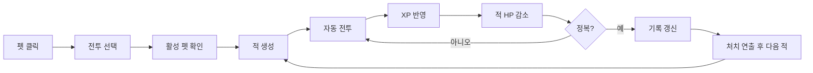

# 전투 시스템

현재 실행: Electron 내부 `src/domain/engine.ts`가 아래 규칙을 처리한다. 기본 앱·전투·데모에는 Cargo나 Rust 프로세스가 필요하지 않다. 기존 Rust 규칙을 이식했으며 [전환 기록](electron-engine-migration.md)에 검증 범위를 기록한다.

## 흐름

```mermaid
flowchart LR
  A[펫 클릭] --> B[전투 선택]
  B --> C[활성 펫 확인]
  C --> D[적 생성]
  D --> E[자동 전투]
  E --> F[XP 반영]
  F --> G[적 HP 감소]
  G --> H{정복?}
  H -- 아니오 --> E
  H -- 예 --> I[기록 갱신]
  I --> J[처치 연출 후 다음 적]
  J --> D
```

## 전투 규칙

- 상태 흐름: `대기 → 자동 전투 → 적 정복 연출 → 다음 적 등장 → 자동 전투`
- 사용자가 중지하면 `일시 정지`가 된다.
- 호스트가 주입한 공통 `PetClient`의 활성 펫·레벨·누적 XP를 읽어 전투 진행도를 복원한다. 데모의 버튼은 표현 확인용이다.
- 적 HP가 0이 되면 처치 연출 1.48초 → 다음 적 등장 0.72초 → 자동 전투로 이어진다. 클릭은 처치 연출 생략용이며 필수가 아니다. 중지 상태는 전환 후에도 유지한다.
- 펫별 스테이지·구간 XP는 저장된 누적 XP에서 계산하며, 펫 변경·재시작 시 해당 펫의 진행도를 복원한다.
- 활성 펫이 없으면 펫 선택 안내를 표시한다. 임의의 펫을 생성하지 않는다.

## 레벨·적 변경 규칙

- COMMON·RARE·EPIC 모두 같은 기준이다. 색마다 **소 2 → 중 2 → 대 3레벨 상당 XP**를 사용한다.
- 7색 × 3크기 = 21단계. Lv.1에서 시작해 **Lv.50(누적 1,090 XP)에 한 바퀴 정복**, 다음 빨강·소로 이어진다.
- 레벨 숫자를 나누지 않고 성장 담당자가 제공한 `levelXpCosts`를 해당 구간만큼 합산한다. 아래는 현재 곡선 `10 + floor(level/2)` 기준이며 각 크기의 마지막 레벨 도중까지 해당 적이다.

| 색상          | 소: 레벨 / 목표 XP | 중: 레벨 / 목표 XP | 대: 레벨 / 목표 XP | 색상 완료 누적 XP |
| ------------- | ------------------ | ------------------ | ------------------ | ----------------- |
| 빨강          | 1~2 / 21           | 3~4 / 23           | 5~7 / 38           | 82                |
| 주황          | 8~9 / 28           | 10~11 / 30         | 12~14 / 49         | 189               |
| 노랑          | 15~16 / 35         | 17~18 / 37         | 19~21 / 59         | 320               |
| 초록          | 22~23 / 42         | 24~25 / 44         | 26~28 / 70         | 476               |
| 파랑          | 29~30 / 49         | 31~32 / 51         | 33~35 / 80         | 656               |
| 보라          | 36~37 / 56         | 38~39 / 58         | 40~42 / 91         | 861               |
| 파스텔 무지개 | 43~44 / 63         | 45~46 / 65         | 47~49 / 101        | 1,090             |

- 소·중·대의 표시 높이는 56·64·80px이다. 등급은 공격 이펙트에만 차이를 준다.
- 구간 패턴은 Rust 전투 도메인의 `[2, 2, 3]`이다. `battle-rules.json`의 `intervalLevels`는 기존 호스트 연결 호환용이며 보유 펫의 진행 속도에 더 이상 적용하지 않는다.
- 만렙 이후에도 누적 XP로 전투를 진행한다. 마지막 레벨 비용 35 XP를 적용하여 다음 바퀴의 소·중·대는 각각 70·70·105 XP가 된다.
- 적 HP = `1 - (현재 구간 XP / 구간 목표 XP)`. 공격 모션은 XP나 피해량을 생성하지 않는다.
- 예: 빨강·소는 0 XP에서 HP 100%, 20 XP에서 약 4.76%, 21 XP에 정복한다. 다음 빨강·중은 23 XP 구간이다.
- 정복 중 HP는 0이며, 처치 연출 후 다음 적·배경으로 자동 전환한다. 전환 중 XP가 추가되면 연출을 재시작하지 않고 최신 다음 단계에 반영한다.
- 여러 구간을 한 번에 넘으면 정복 연출은 한 번, 이벤트의 `skippedStages`로 생략한 수를 전달한다.
- 처음 불러온 높은 레벨의 펫은 과거 정복 연출 없이 현재 스테이지로 복원한다.

| 적 순서            | 배경         |
| ------------------ | ------------ |
| 빨강 → 주황 → 노랑 | 달빛 버섯 숲 |
| 초록 → 파랑 → 보라 | 수정 유적    |
| 파스텔 무지개      | 별빛 사원    |

각 색의 소·중·대 이후 다음 색으로 순환한다. 크기·색상·HP 미리보기 버튼은 저장된 성장·스테이지에 영향을 주지 않는다. 정복 연출에는 처치한 적 크기를 유지하고 다음 적 등장부터 새 크기를 적용한다.

## 공통 인터페이스 연결

- `PetBattleIntegration`에 `PetClient`·Rust 엔진·성장 곡선을 주입한다.
- 전투는 `getActivePet()`·`listOwnedPets()`만 호출한다. 저장소·테이블·다른 기능 구현체에 직접 접근하지 않는다.
- 성장 담당자가 XP를 저장한 뒤 재조회한다. 알림의 XP 증가량을 다시 더하지 않는다.
- `TokenClient`의 통계는 펫별 성장 값이 아니므로 전투에서 XP로 환산하지 않는다. 토큰 저장·환산·활성 펫 선택은 해당 기능 담당자의 책임이다.
- 전투 renderer는 토큰·임의 XP·명부 변경 명령을 보낼 수 없다.
- 앱 IPC 등록은 호스트 담당자의 연결 지점이며, 전투 패키지 밖 구현은 이 계약의 범위가 아니다. 상세 연결 예시는 `token-growth-integration.md`를 따른다.

## 경계

- Rust: 전투 상태, 정복 간격, HP 계산, 이벤트, 정복 전환·수동 미리보기 타임라인
- TypeScript: IPC 연결, 화면용 scene·지면 이동·지연 카메라 계산, Electron renderer. 이동·타격 연출로 HP·XP를 생성하지 않는다.
- 통신: 한 줄에 하나의 JSON 요청·응답, `requestId`로 대응
