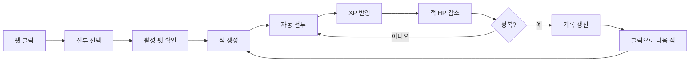

# 전투 시스템

## 흐름

```mermaid
flowchart LR
  A[펫 클릭] --> B[전투 선택]
  B --> C[활성 펫 확인]
  C --> D[적 생성]
  D --> E[자동 전투]
  E --> F[XP 반영]
  F --> G[적 HP 감소]
  G --> H{정복?}
  H -- 아니오 --> E
  H -- 예 --> I[기록 갱신]
  I --> J[클릭으로 다음 적]
  J --> D
```

## 전투 규칙

- 상태 흐름: `대기 → 자동 전투 → 적 정복 연출 → 다음 적 등장 → 자동 전투`
- 사용자가 중지하면 `일시 정지`가 된다.
- 앱에서는 공통 `PetClient`의 활성 펫·레벨·누적 XP를 읽어 전투 진행도를 복원한다. 데모의 버튼은 표현 확인용이다.
- 적 HP가 0이 되면 처치 모션 후 클릭을 기다린다. 클릭하면 다음 적을 생성한다.
- 펫별 스테이지·구간 XP는 저장된 누적 XP에서 계산하며, 펫 변경·재시작 시 해당 펫의 진행도를 복원한다.
- 활성 펫이 없으면 펫 선택 안내를 표시한다. 임의의 펫을 생성하지 않는다.

## 레벨·적 변경 규칙

| 펫 등급 | 적 1마리 정복 구간 | 첫 정복에 필요한 XP |
| ------- | ------------------ | ------------------- |
| COMMON  | 12레벨 상당 XP     | 156                 |
| RARE    | 10레벨 상당 XP     | 125                 |
| EPIC    | 8레벨 상당 XP      | 96                  |

- 레벨 숫자를 나누지 않고 성장 패키지의 `requiredXp(level)`를 해당 구간만큼 합산한다.
- COMMON 예: 누적 156 XP → 2스테이지, 384 XP → 3스테이지, 684 XP → 4스테이지.
- 설정은 `battle-rules.json`의 `intervalLevels`에서 변경한다. 앱 재시작 시 적용된다.
- 만렙 이후에도 누적 XP로 전투를 진행하며 마지막 레벨의 필요 XP를 반복 적용한다.
- 적 HP = `1 - (현재 구간 XP / 구간 목표 XP)`. 공격 모션은 XP나 피해량을 생성하지 않는다.
- 정복 중 HP는 0이며, 처치 연출 후 클릭하면 다음 적·배경으로 바뀐다.
- 여러 구간을 한 번에 넘으면 정복 연출은 한 번, 이벤트의 `skippedStages`로 생략한 수를 전달한다.
- 처음 불러온 높은 레벨의 펫은 과거 정복 연출 없이 현재 스테이지로 복원한다.

| 적 순서            | 배경         |
| ------------------ | ------------ |
| 빨강 → 주황 → 노랑 | 달빛 버섯 숲 |
| 초록 → 파랑 → 보라 | 수정 유적    |
| 파스텔 무지개      | 별빛 사원    |

일곱 색을 순환한다. 색상·HP 미리보기 버튼은 저장된 성장·스테이지에 영향을 주지 않는다.

## 토큰 연결

- 입력+출력 5,000토큰 = 1 XP. 캐시 생성·읽기는 XP에서 제외한다.
- 미만 잔여 토큰은 펫별로 이월한다. 활성 펫이 없을 때의 사용량은 소급 지급하지 않는다.
- 토큰 기록·잔여분·성장은 공통 SQLite의 같은 트랜잭션에서 저장한다.
- 중복 수집 키는 한 번만 반영한다. 초기 스캔과 데모 기록 심기는 XP를 지급하지 않는다.
- 전투 renderer는 토큰·임의 XP·명부 변경 명령을 보낼 수 없다.

## 경계

- Rust: 전투 상태, 정복 간격, HP 계산, 이벤트, 모션 타임라인
- TypeScript: IPC 연결, 화면용 scene 계산, Electron renderer
- 통신: 한 줄에 하나의 JSON 요청·응답, `requestId`로 대응
